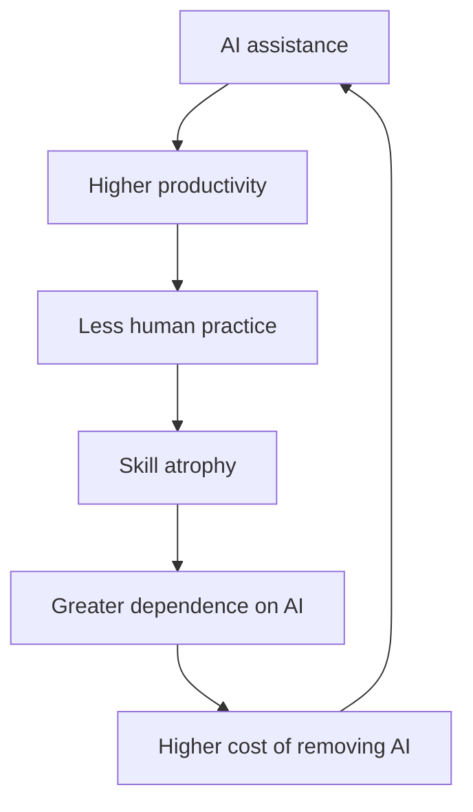

# When Intelligence Becomes Infrastructure

*What happens when knowledge stops being something we store and becomes something that acts?*

Humanity has spent thousands of years moving knowledge outside the human brain.

First came writing.

Then books.

Then libraries.

Then mechanical and electronic storage.

Then computers.

Then the internet.

Each step changed the relationship between humans and knowledge.

A book could preserve knowledge beyond the lifetime of its author. A library could collect knowledge beyond the capacity of a single person to remember. Computers could process information faster than humans could calculate. The internet could make information available almost anywhere.

But all of these systems shared an important limitation:

**They stored and transmitted knowledge.**

They did not independently act upon it.

Artificial intelligence changes that boundary.

## From storage to action

The progression increasingly looks like this:

An LLM can retrieve and transform enormous amounts of information.

An agent can use that information to operate software.

An agent connected to APIs can interact with external systems.

An AI connected to sensors can perceive the physical world.

A robot can turn decisions into physical action.

The distinction between **knowing** and **doing** therefore begins to disappear.

That is a profound change.

## The first dependency

At first, AI is simply an assistant.

A developer uses it to write code.

A lawyer uses it to summarize documents.

A doctor uses it to search medical information.

A company uses it to analyze data.

The human remains capable of doing the task.

AI merely accelerates it.

But then the economics change.

If the AI performs the task ten times faster, why would the human continue doing it manually?

The organization gradually reorganizes around the AI.

The human performs the remaining tasks.

Then the human stops practicing the automated tasks.

Eventually, something subtle happens.

The AI is no longer merely **helping the organization perform a capability**.

The organization has stopped possessing that capability independently.

## The dependency loop

This is not necessarily bad.

We already outsource enormous amounts of knowledge.

I don't know how to manufacture a transistor.

I don't know how to refine silicon.

I don't know how to manufacture an aircraft engine.

Modern civilization depends on capabilities that almost nobody individually possesses.

Specialization is one of the foundations of civilization.

The question is therefore not:

> **Should humans know everything themselves?**

They never have.

The more important question is:

> **Which capabilities can society safely stop knowing?**

## The institutional version

Consider an organization that has used AI for ten years.

AI writes much of its software.

AI produces its documentation.

AI analyzes incidents.

AI proposes architectures.

AI performs testing.

AI searches its historical knowledge.

AI helps management make decisions.

The organization becomes extraordinarily productive.

But now imagine the AI disappears.

Not for an hour.

For a week.

The organization discovers that many of the people who remain no longer know how to reproduce the old processes.

The organization has not merely lost a tool.

It has lost part of its institutional capability.

This creates a new category of technological risk:

**cognitive dependency.**

## Dependency can become infrastructure

Once a capability becomes essential, its price becomes less important.

Imagine an organization that can no longer operate without a particular AI provider.

The relationship changes.

The provider is no longer simply selling software.

It is supplying part of the organization's cognitive infrastructure.

The organization may eventually reach a point where it cannot reasonably say:

> "We will stop using the system."

The cost of stopping has become larger than the cost of continuing.

This is familiar in other infrastructures.

We depend on electricity.

We depend on telecommunications.

We depend on logistics.

We depend on cloud infrastructure.

AI introduces something unusual:

**dependency on externally provided cognitive capability.**

## The paradox

AI can therefore make an organization simultaneously:

**more capable** and **less self-sufficient**.

That isn't necessarily a contradiction.

A modern organization can be extraordinarily capable precisely because it relies on infrastructure outside itself.

The question is where the boundary should be.

Some knowledge can probably be outsourced safely.

Other knowledge may be too important to lose.

That distinction will become increasingly difficult as AI moves from answering questions to taking actions.

Because once intelligence becomes infrastructure, removing it is no longer equivalent to removing a software feature.

It may be equivalent to removing part of the organization itself.

And that leads to a question that may become increasingly important:

> **If intelligence becomes infrastructure, who owns the infrastructure of our intelligence?**
